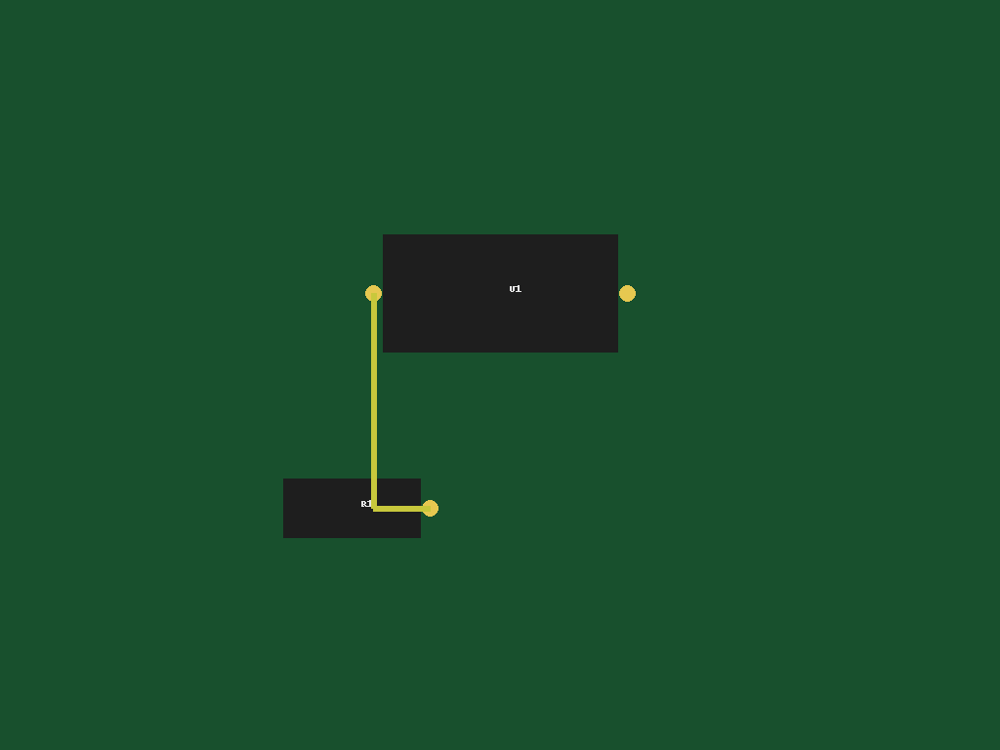
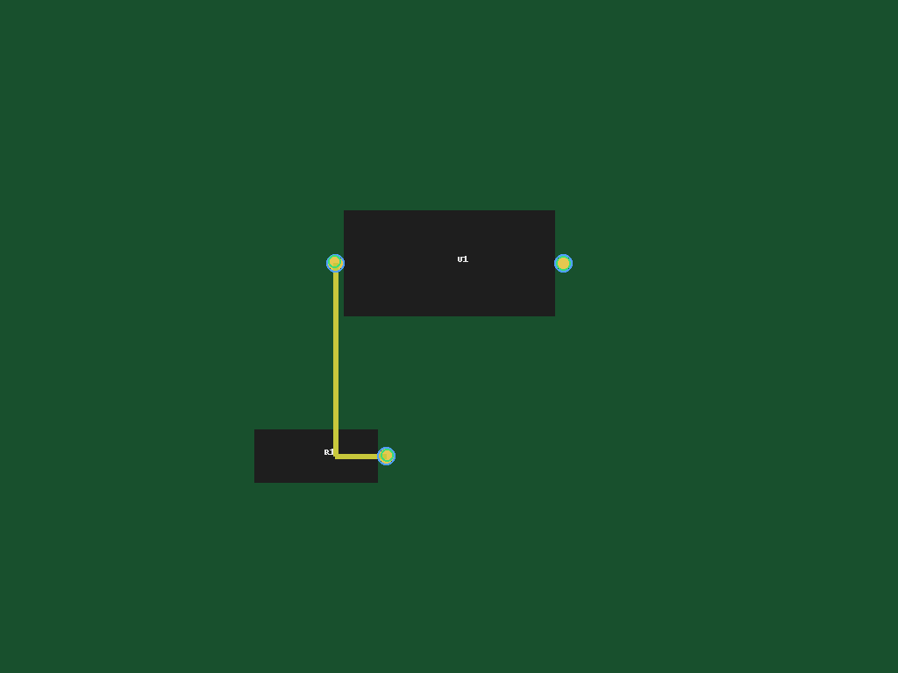

# pcb-partgraph — tiny PCB vision + graph

**What it is:** a small, self-contained project that generates a synthetic PCB image, writes a ground-truth **graph** (components, pads, traces), then runs a simple **pad detector** and reports **precision / recall / F1** with a visual overlay. Structured as a real Python **package** (`src/` layout) so logic is reusable and testable.

---

## Quickstart

```bash
# 1) create & activate a venv (Python 3.9+)
python -m venv .venv
# Windows: .venv\Scripts\activate
# Linux/macOS: source .venv/bin/activate

# 2) install project (editable) + deps
pip install -e .

# 3) make a small scene and its ground-truth graph
python scripts/make_scene_v1.py

# 4) run detector + metrics + overlay (TP/FP/FN)
python scripts/eval_pads_overlay_v1.py

# (optional) 5) featurize the graph for future GNN/rules
python scripts/featurize_scene_v1.py
```

## Outputs
- `outputs/scene_v1.png` – synthetic board
- `outputs/scene_v1.graph.json` – ground-truth graph (components, pads, traces)
- `outputs/scene_v1.pads.overlay.png` – **GT** (blue), **TP** (green), **FP** (red), **FN** (purple)

## Screenshots

<p align="center">
  
  &nbsp;&nbsp;
  
</p>

## Repo layout
```
repo/
  src/pcb_partgraph/            # library (reusable code)
    __init__.py
    detect/
      __init__.py
      pads.py                   # pad detector: image → [{x,y,r}]
    gnn/
      featurize.py              # (optional) export tensors
  scripts/                      # thin runners
    make_scene_v1.py
    eval_pads_v1.py
    eval_pads_overlay_v1.py
    featurize_scene_v1.py
  data/     (ignored)           # datasets
  outputs/  (ignored)           # generated images/overlays
  pyproject.toml  .gitignore  README.md
```

## What’s implemented
- **Synthetic scene + ground-truth graph** (components, pads, traces)
- **Pad detector** (color mask → 8-connected components → centroid & equivalent radius → list of `{x,y,r}`)
- **Evaluator + overlay** (nearest-neighbor match within `MATCH_TOL × radius`; prints precision/recall/F1; TP/FP/FN overlay)
- **Featurizer (optional)** to NumPy tensors (`x`, `edge_index`, `edge_attr`) for rules or a tiny GNN later

## Tuning
- `PAD_COLOR` / `COLOR_TOL` (in `pads.py`): stricter → ↑precision, looser → ↑recall
- `MIN_AREA` (in `pads.py`): drop tiny blobs/noise
- `MATCH_TOL` (in eval scripts): detection counts if within `tol ×` GT radius

## Precision / Recall / F1 
- **Precision = TP / (TP + FP):** “Of what I predicted, how many were right?”
- **Recall = TP / (TP + FN):** “Of what truly exists, how many did I find?”
- **F1 =** harmonic mean of precision & recall → high only if both are high

